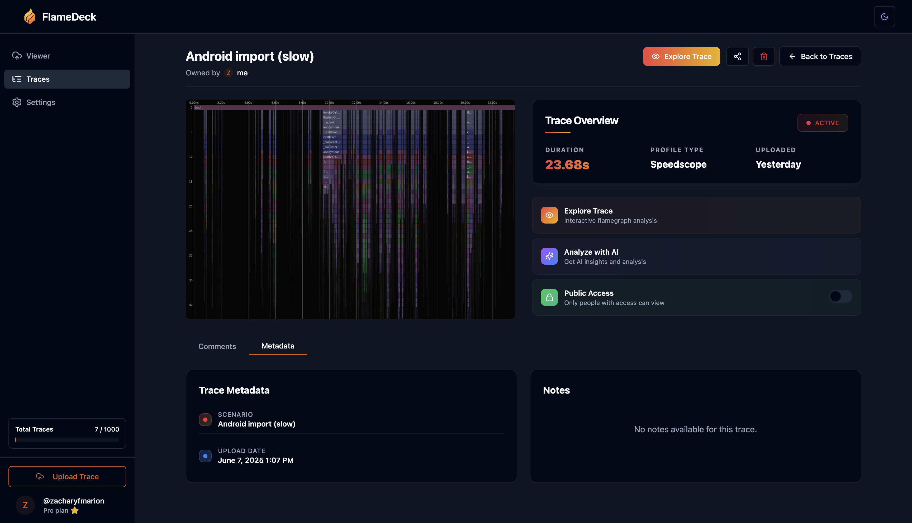

# FlameDeck

**Store, analyze, and debug performance traces with your team—powered by AI**

---

## 🚀 What is FlameDeck?

FlameDeck is a collaborative platform that transforms how teams work with performance data. Upload your profile once, explore it anywhere, and share insights with your team — all powered by AI that understands your code.

### ✨ Key Features

| Feature | Description |
|---------|-------------|
| 🔄 **Universal Format Support** | Import traces from Node.js, Go, Rust, Python, Chrome, React Native, and 20+ other tools |
| 📊 **Interactive Visualizations** | Timeline, Left-Heavy, and Sandwich flamegraphs with smooth, hardware-accelerated rendering |
| 🤖 **AI-Powered Insights** | Ask questions in plain English and get actionable optimization recommendations |
| 👥 **Team Collaboration** | Comment on frames, share public links, and manage permissions seamlessly |
| 🛠️ **Developer-First** | Drag-and-drop browser uploads, full CLI & REST API, plus CI/CD integration |

### 📦 What's in this Repository

<table>
<tr>
<td width="50%">

**🖥️ Core Application**
- [`apps/client/`](apps/client/) - React web application (hosted at [flamedeck.com](https://flamedeck.com))
- [`supabase/`](supabase/) - Database schema & edge functions
- [`packages/`](packages/) - Shared libraries & utilities

</td>
<td width="50%">

**🔧 Developer Tools**
- [`cli-rust/`](cli-rust/) - Command-line interface for interactin with the FlameDeck server
- [`@flamedeck/upload`](packages/client-uploader/) - JS/TS upload library  
- [`@flamedeck/flamechart-mcp`](packages/flamechart-mcp/) - MCP server for analyzing trace files locally

</td>
</tr>
</table>

## 🔗 Links

- **Website:** [flamedeck.com](https://www.flamedeck.com)
- **Documentation:** [docs.flamedeck.com](https://docs.flamedeck.com)

## 🤝 Contributing

We are still setting up some contribution guides but any PRs are welcome!

---

**Built with ❤️ by the FlameDeck team**

[⭐ Star us on GitHub](https://github.com/flamedeck-org/flamedeck) • [🐦 Follow us on X](https://twitter.com/flamedeck)

