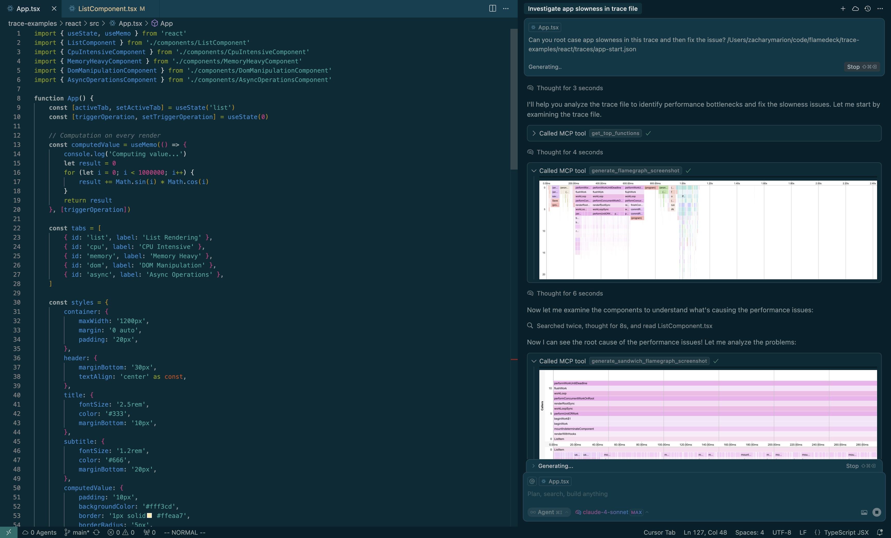

# 🔥 Flamechart MCP Server

[](https://cursor.com/install-mcp?name=flamedeck&config=eyJjb21tYW5kIjoibnB4IC15IEBmbGFtZWRlY2svZmxhbWVjaGFydC1tY3AifQ%3D%3D)

MCP server for analyzing performance profiles (Go, JavaScript, Python, etc.) using flamegraphs. Works entirely offline for local traces or with FlameDeck's hosted storage.

-----

<div align="center">

[**📖 Documentation**](https://docs.flamedeck.com/mcp-server) • [**🎥 Demo Video**](https://www.youtube.com/watch?v=wNoL82YvuAA) • [**🔑 Get API Key**](https://flamedeck.com/settings/api-keys) 

</div>

-----



## ✨ Features

- 🔍 **Generate Visual Flamegraphs** - Use the strong vision capabilities of reasoning llms to debug performance issues
- 🌐 **Multi-Format Support** - Chrome, Firefox, Node.js, pprof, stackprof and more
- 🔌 **Works Offline** - Only requires an API key if using [flamedeck.com](https://flamedeck.com) for trace hosting

## 🚀 Quick Start

### Local Files Only (No API Key)

> Allows you to reference traces stored on your local file system (e.g. /Users/johnsmith/etc)

[](https://cursor.com/install-mcp?name=flamedeck&config=eyJjb21tYW5kIjoibnB4IC15IEBmbGFtZWRlY2svZmxhbWVjaGFydC1tY3AifQ%3D%3D)

**Manual Installation:**
```json
{
  "mcpServers": {
    "flamechart-debug": {
      "command": "npx",
      "args": ["-y", "@flamedeck/flamechart-mcp"]
    }
  }
}
```

### Remote FlameDeck Traces (API Key Required)

> Allows you to reference remote traces hosted at [flamedeck.com](https://flamedeck.com)

[](https://cursor.com/install-mcp?name=flamedeck&config=eyJjb21tYW5kIjoibnB4IC15IEBmbGFtZWRlY2svZmxhbWVjaGFydC1tY3AiLCJlbnYiOnsiRkxBTUVERUNLX0FQSV9LRVkiOiJ5b3VyX2FwaV9rZXlfaGVyZSJ9fQ%3D%3D)

**Manual Installation:**
```json
{
  "mcpServers": {
    "flamechart-debug": {
      "command": "npx",
      "args": ["-y", "@flamedeck/flamechart-mcp"],
      "env": {
        "FLAMEDECK_API_KEY": "your_api_key_here"
      }
    }
  }
}
```

> [!NOTE]
> You will need to create an API key with `trace:download` permissions in your [Flamedeck settings](https://flamedeck.com/settings/api-keys).

> [!TIP]
> For optimal flamegraph analysis, we recommend using AI models with strong image understanding capabilities such as OpenAI's o3.

## Practical Examples for Cursor/AI Assistants

### Analyzing Local Trace Files

**Example prompt for Cursor:**
```
Analyze this trace file and find out why my React app's rendering is slow:
/Users/developer/profiles/react-app-slow.cpuprofile

Focus on any React-related functions that might be causing bottlenecks
```

### Analyzing Remote Flamedeck Traces

**Example prompt for team collaboration:**
```
My teammate shared this performance trace from production. Analyze it and help me understand the bottlenecks:
https://www.flamedeck.com/traces/98508d02-1f2a-4885-9607-ecadceb3d734

Focus on:
1. Database query performance 
2. Any functions taking >100ms
```

**Example prompt for API performance investigation:**
```
Our API response times spiked yesterday. Root cause with this production trace:
https://www.flamedeck.com/traces/abc123...
```

## 🛠️ Available Tools

| Tool | Description | Use Case |
|------|-------------|----------|
| `get_top_functions` | Find slowest functions by self/total time | Identify bottlenecks |
| `generate_flamegraph_screenshot` | Create visual flamegraph PNG | Share insights, reports |
| `generate_sandwich_flamegraph_screenshot` | Focus on specific function callers/callees | Deep-dive analysis |

## 📁 Supported Formats

FlameDeck builds on top of the incredible Speedscope project, and support all trace formats listed [here](https://github.com/jlfwong/speedscope?tab=readme-ov-file#supported-file-formats). Because the code is forked, this may diverge in the future.

## Development

### Building

```bash
yarn build
```

### Testing Locally

```bash
# Build the package
yarn build

# Test with MCP Inspector
npx @modelcontextprotocol/inspector node dist/cli.js
```

## Publishing

1. Update version in `package.json`
2. Build the package: `yarn build`
3. Publish: `yarn publish`

## Related Packages

- [`@flamedeck/upload`](https://www.npmjs.com/package/@flamedeck/upload) - Client library for uploading traces

## License

ISC 